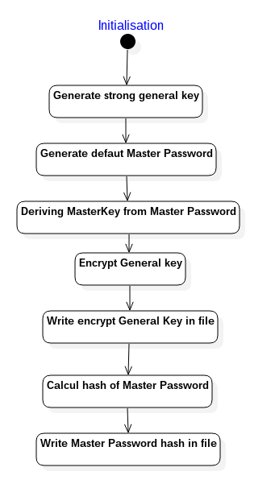
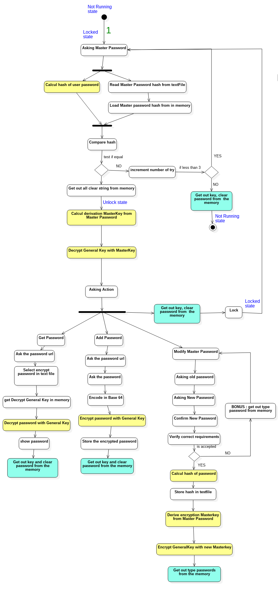

# Labo2_CAA

*Yann Lederrey*

## Utilisation :

**Mot de passe par défaut : *yannMerite6***

1. Compilez** le gestionnaire de passwords avec la ligne suivante (linux) :  `gcc Crypto.h Crypto.c FileManager.c FileManager.h UserInteraction.h UserInteraction.c Strings_en.h base64.c base64.h main.c -o passwordManager -lsodium`
2. **Initialisez** le gestionnaire de password avec la commande suivante : `./passwordManager init` , *le temps d'initialisation est d'environ 40 secondes*.
3. **Démarrez** le programme avec la commande suivante : `./passwordManager` , *le temps de login est d'environ 20 secondes*.

**Si vous rencontrez une erreur de type ** : *"Error during encryption of password"* **ou** *"Error during decryption of password"*  : 

- Si c'était lors de l'ajout ou la récupération d'un password, essayer une nouvelle fois avec un url de password différent.
- Si c'était à une autre moment, videz le fichier *"password.txt"* et relancer une initialisation.

## Analyse :

### Introduction : 

requirements :

- Report describing how you modelled your security
- Code with makefile
- guideline of how to use your program.
- store in textfile

**Informations :**

- there is only one password to remember : master password
- Password manager has three state with *different security requirements* : 
  - Not running (state when the manager is before being launched)
  - Unlocked (the user has entered his master password)
  - Locked (user lock manager, to recover it he has to retype his password)

**Not running State :**

Password store in the disk

- password  should be protect against recover without master password
- if somone know one stored password that not help him to recover Master password

**Unlocked State :**

return password when we type website

- It should be impossible to recover Master password from the memory
- Password unaccessed should not be in clear in the memory

**Locked State** :

- same security requirement than the Not Running State.

**Requirements functionalities :**

- lock password manager in locked State
- recover password manager to Unlocked State
- Adding new password in database
- change master password

### Choix d'implémentations :

- Afin d'authentifier l'utilisateur j'ai choisis l'utilisation d'un Hash du **Master Password**, seul le hash est stocké dans le fichier de données.

- Afin de chiffrer et déchiffrer j'ai choisis d'utiliser une clé indépendante (*General Key*) du master password mais qui sera chiffré via une clé dérivée de ce dernier.

  La raison est que si je dérive une clé à partir du master password, que je chiffre directement les mots de passe avec et que l'utilisateur choisi de modifier son master password, tous les password devront être rechiffré. Dans mon cas, seul la general key devra être rechiffrée.

  La *General Key* est donc stockée chiffrée dans le fichier de données.

- L'utilisateur peut changer de master password seulement si il connait le master password précédent et qu'il entre deux fois son nouveau password. Ensuite, on regénére la *master Key* à partir du *master password* via une dérivation de clé et on re-chiffre la *General Key*. 

- Afin d'éviter que des éléments importants restent accéssibles dans la mémoire, à chaque fin d'action principale ou en cas de fermeture du programme ou lock, je vide la mémoire de tous password en clair, ou clé de chiffrement.

### Choix cryptographiques :

- Hash du *Master Password* :

  - algorithme : Argon2
  - librairie : libsodium
  - iteration count : `crypto_pwhash_OPSLIMIT_MODERATE*5` (~15)
  - memeory : `crypto_pwhash_MEMLIMIT_MODERATE*5` (~1342177280)
  - environ 40 secondes d'attente, temps raisonnable, sécurité acceptable

  

- Dériviation de clé du *Master Password* : 

  - algorithme : Argon2

  - librairie : libsodium

  - iteration count : `crypto_pwhash_OPSLIMIT_INTERACTIVE`

  - length of output : `crypto_pwhash_MEMLIMIT_INTERACTIVE`

    - Sel : généré via `randombytes_buf` 

    

- Chiffrement du *General Key* :

  - algorithme : ChaCha20 Poly1305
  - nonce : généré via `randombytes_buf` 

  

- Chiffrement des passwords :

  - algorithme : ChaCha20 Poly1305
  - nonce : généré via `randombytes_buf` 

### Initialisation : 

**Initialisation des paramètre par défauts :**

- **General Key** : génération d'une bonne clé cryptographique qui servira à chiffrer, déchiffrer les mots de passes. Utilisation de la méthode `crypto_aead_chacha20poly1305_keygen`

- **Master Password :** génération d'un password par défaut, ce password va servir à authentifier l'utilisateur ainsi qu'à dériver une clé permettant de chiffrer la *General key*
- *Master Password* **Deriving Key** : Dérivation du master password afin d'obtenir une clé nous permettant de chiffrer la *General key*
- **Hash** du *Master password* : Calcul d'un Hash du master password nous permettant d'authentifier l'utilisateur.

**Ecriture des paramètres :** les paramètres suivants sont enregistré dans un fichier text :

*Les paramètres sont encodé en Base64 puis inscrit dans le fichier sous forme de key-value*

- General Key chiffré via la clé dérivée du Master Password
- Longeur de la General Key chiffrée
- Nonce de la General Key
- Sel de la Master Key
- Hash du master password

### Déroulement du programme : 

**Ecriture des paramètres :** les paramètres suivants sont enregistré dans un fichier text :

*Les paramètres sont encodé en Base64 puis inscrit dans le fichier sous forme de key-value, les mots de passes sont encodés en Base64 avant leur chiffrement afin de permettre les caractères spéciaux.*

- Passwords chiffrés (Base64 => Encrypt => Base64)
- Nonce des passwords
- Longeur des password chiffrés.

*En jaune vous trouverez les points sensibles au sens cryptographique*

*En bleu vous trouverez les points sensibles au sens accès mémoire.*

